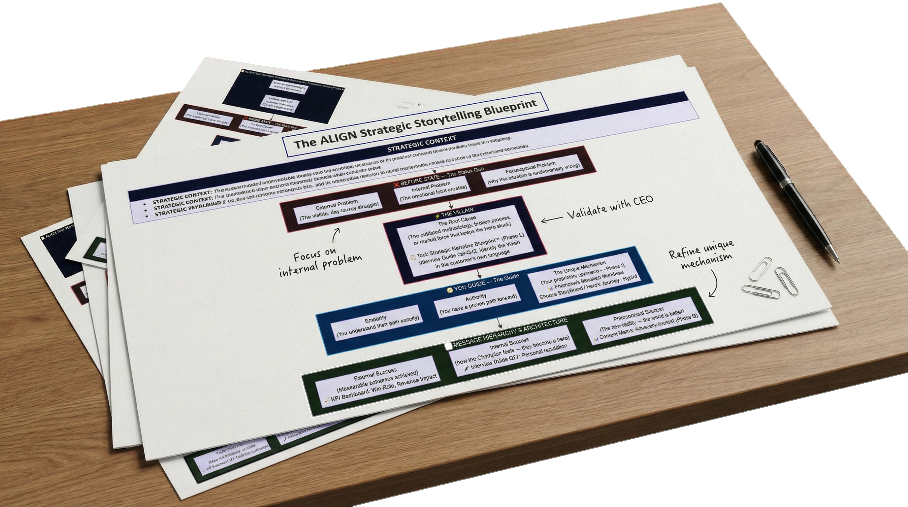
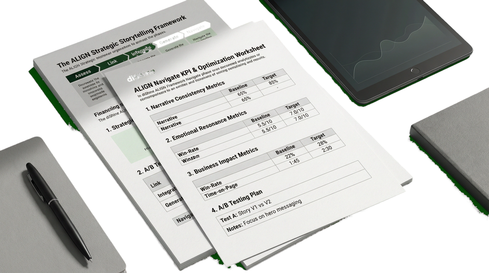
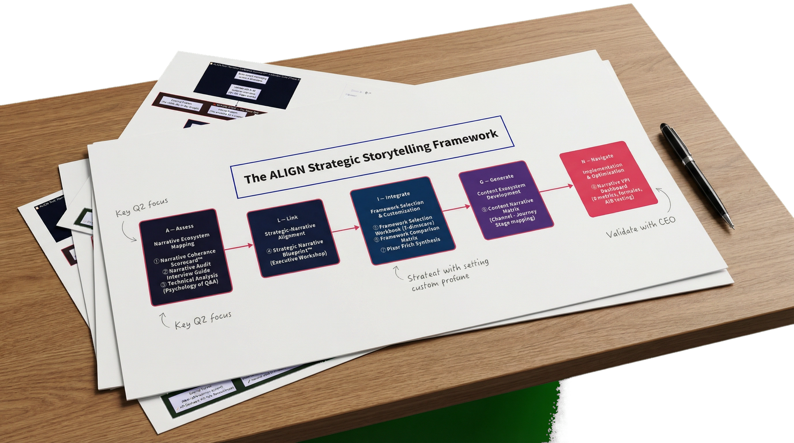
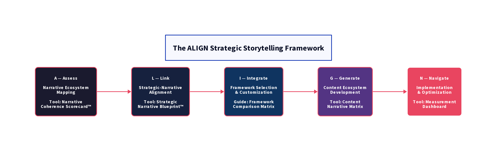
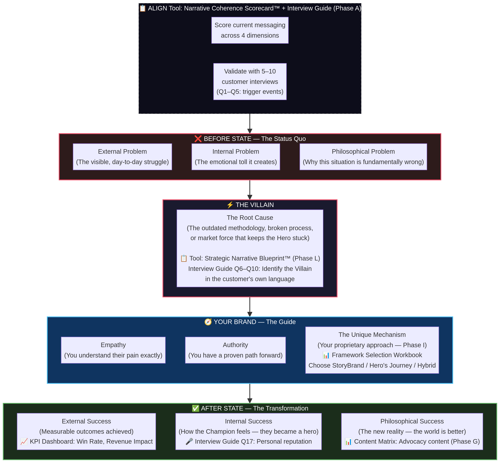
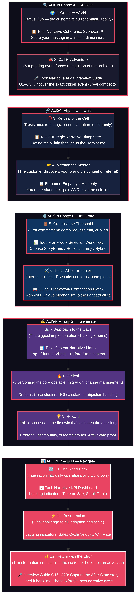

# 📣 ALIGN Storytelling Framework: driving B2B/B2C growth through narrative architecture

<div align="center">
  
[](https://dishine.it/)

***Transform. Automate. Shine!***

[](https://dishine.it/blog/strategic-storytelling-to-improve-brand-identity-and-get-revenue-growth/)
[](https://linkedin.com/company/100682596)
[]()
[](LICENSE)

<p align="center">
  
</p>

> "Facts tell, stories sell — but most companies still lead with features instead of narratives."

*The ALIGN framework is an open-source methodology for diagnosing narrative disconnects and implementing strategic storytelling across B2B digital ecosystems. It bridges the gap between high-level brand identity and measurable revenue growth by treating storytelling as a core business capability, not a marketing tactic.*

**Version:** 1.2.0 | **License:** MIT | **Created by:** [diShine Digital Agency](https://dishine.it). Read more on the [diShine blog](https://dishine.it/blog/strategic-storytelling-to-improve-brand-identity-and-get-revenue-growth/).

</div>

<p align="center">
  
</p>

We first introduced the ALIGN framework through [our research on strategic storytelling](https://dishine.it/blog/strategic-storytelling-to-improve-brand-identity-and-get-revenue-growth/). We believe that effective methodologies should be public, not just because "sharing is caring," but because a framework is only as effective as the expertise behind it. Knowledge is a map, but experience is the compass.

While our internal workflows have evolved into more specialized techniques, the core ALIGN methodology remains a high-impact asset. We release this part of our framework to help others bridge the narrative gap, though we advise that these tools be approached by those with experience in strategic communication and marketing performance.

<p align="center">
  
</p>

> **New to strategic storytelling?** Check the [glossary](GLOSSARY.md) for definitions of key terms used throughout this repository.

---

## Why this framework exists

Despite mountains of evidence showing storytelling's effectiveness, most B2B companies are stuck drowning prospects in feature lists and tech specs. The problem is not a lack of content, it is a lack of narrative architecture.

When storytelling is not directly linked to business strategy, it becomes a creative exercise rather than a strategic asset. According to McKinsey, companies that align their narrative architecture with strategic priorities achieve **18% higher revenue growth** than those with disconnected approaches. Furthermore, a 2023 Forrester study found that only **23% of B2B marketers** can effectively measure the impact of their narrative approach on sales performance.

The ALIGN framework solves this by providing a structured, repeatable process for building, implementing, and measuring strategic narratives.

---

## How to use this framework

There are two ways to work through the ALIGN framework:

1. **Read the guides and fill in the templates.** Start with the [step-by-step user guide](guides/how-to-use-this-framework.md), which covers the correct sequence, the responsible owner for each phase, and the strategic rationale behind every tool in this repository. Then work through the markdown templates one by one.

2. **Use the ALIGN Navigator.** Open [`tools/align-navigator.html`](tools/align-navigator.html) in any browser for an interactive, guided experience. It covers all five phases with live scoring, form fields, auto-save, and one-click markdown export — no installation required.

Both paths follow the same sequence: assess your current narrative with the [Narrative Coherence Scorecard](templates/01-assess-narrative-scorecard.md), validate findings through [customer interviews](templates/narrative-audit-interview-guide.md), build the strategic foundation with the [Narrative Blueprint](templates/02-link-narrative-blueprint.md), select the right framework structure with the [Framework Selection Workbook](templates/03-integrate-framework-selection.md), deploy with the [Content Narrative Matrix](templates/04-generate-content-matrix.md), and measure impact with the [Narrative KPI Dashboard](templates/05-navigate-measurement-dashboard.md).

If any of those terms are unfamiliar, see the [glossary](GLOSSARY.md). For common questions, see the [FAQ](guides/faq.md).

---

## The 5 phases of ALIGN



The framework consists of five interconnected phases that guide organizations from narrative assessment through implementation and optimization.

### A — Assess: narrative ecosystem mapping

Map narrative gaps across all digital touchpoints. Identify story fragmentation, measure emotional impact, and evaluate competitive differentiation, establishing your baseline for strategic enhancement. This phase also includes customer validation: interviewing recent wins and losses to verify that your internal narrative matches external market reality.

**Output:** A **Narrative Coherence Score™ (0–100)** that quantifies the alignment between your current storytelling and ideal state, validated against real customer interviews.

**Tools:**
- [Narrative Coherence Scorecard](templates/01-assess-narrative-scorecard.md): the scoring template.
- [Narrative Audit Interview Guide](templates/narrative-audit-interview-guide.md): 20 customer validation questions.
- [Technical Analysis](guides/narrative-audit-technical-analysis.md): the psychological principles behind each interview question.
- [ALIGN Navigator](tools/align-navigator.html): interactive version with live scoring.

---

### L — Link: strategic-narrative alignment

Align business strategy with storytelling architecture. Connect strategic priorities to narrative elements, ensuring every story component serves your core business objectives and customer needs.

**Output:** A **Strategic Narrative Blueprint™**, the foundational document that dictates *what* you say, *why* you say it, and *how* it positions you in the market.

**Tools:**
- [Strategic Narrative Blueprint](templates/02-link-narrative-blueprint.md): the blueprint template.
- [ALIGN Navigator](tools/align-navigator.html): interactive blueprint worksheet.

---

### I — Integrate: framework selection and customization

Select and customize the optimal combination of storytelling frameworks based on your specific business context. Develop a cohesive narrative architecture that guides all communications.

**Output:** A framework selection decision and a customized narrative architecture built on proven structures (Hero's Journey, StoryBrand, PAS, etc.).



**Tools:**
- [Framework Selection Workbook](templates/03-integrate-framework-selection.md): scoring matrix and element mapping.
- [Framework Comparison Matrix](guides/framework-comparison-matrix.md): detailed comparison of five B2B storytelling frameworks.
- [Technical Analysis](guides/narrative-audit-technical-analysis.md): the psychological principles (Status Quo Bias, Loss Aversion, Anchoring, Curse of Knowledge, Peak-End Rule) behind each of the 20 interview questions.
- [ALIGN Navigator](tools/align-navigator.html): interactive framework diagnostic with automatic recommendation.

---

### G — Generate: content ecosystem development

Produce the strategic content assets needed to implement your narrative across digital touchpoints. Adapt core story elements across channels and journey stages while maintaining consistency.

**Output:** A **Content Narrative Matrix** mapping messages to channels and journey stages.

**Tools:**
- [Content Narrative Matrix](templates/04-generate-content-matrix.md): the planning template.
- [ALIGN Navigator](tools/align-navigator.html): interactive content matrix planner.

---

### N — Navigate: implementation and optimization

Roll out your strategic narrative across channels, align teams, track performance metrics, and continuously refine based on market feedback and business outcomes.

**Output:** A live **Narrative KPI Dashboard** connecting storytelling metrics to revenue outcomes.

**Tools:**
- [Narrative KPI Dashboard](templates/05-navigate-measurement-dashboard.md): the measurement template.
- [ALIGN Navigator](tools/align-navigator.html): interactive KPI dashboard setup.

---

## Repository structure

> **New to the framework?** Start with the **[step-by-step user guide](guides/how-to-use-this-framework.md)**, it explains what to do, who should own it, and why it matters at each phase.

```
align-framework/
├── README.md                              ← This file
├── LICENSE                                ← MIT license
├── CHANGELOG.md                           ← Version history (Keep a Changelog format)
├── CONTRIBUTING.md                        ← How to contribute
├── CODE_OF_CONDUCT.md                     ← Community standards
├── SECURITY.md                            ← Vulnerability reporting policy
├── GLOSSARY.md                            ← Key terms defined for all audiences
│
├── tools/
│   └── align-navigator.html              ← Interactive ALIGN navigator (open in browser)
│
├── templates/
│   ├── 01-assess-narrative-scorecard.md      ← Phase 1: Narrative Coherence Scorecard™
│   ├── 02-link-narrative-blueprint.md        ← Phase 2: Strategic Narrative Blueprint™
│   ├── 03-integrate-framework-selection.md   ← Phase 3: Framework Selection Workbook
│   ├── 04-generate-content-matrix.md         ← Phase 4: Content Narrative Matrix
│   ├── 05-navigate-measurement-dashboard.md  ← Phase 5: Narrative KPI Dashboard
│   └── narrative-audit-interview-guide.md    ← Customer validation: 20-question interview guide
│
├── guides/
│   ├── how-to-use-this-framework.md          ← Step-by-step user guide (start here)
│   ├── framework-comparison-matrix.md        ← Hero's Journey, StoryBrand, PAS, Pixar, JTBD
│   ├── narrative-audit-technical-analysis.md ← Psychological principles behind each interview question
│   └── faq.md                                ← Frequently asked questions
│
└── assets/
    ├── align-framework-overview.d2           ← ALIGN phases diagram (D2 source)
    ├── align-framework-overview.png          ← ALIGN phases diagram (rendered)
    ├── heros-journey-b2b.mmd                 ← Hero's Journey B2B adaptation (Mermaid source)
    ├── heros-journey-b2b.png                 ← Hero's Journey B2B adaptation (rendered)
    ├── narrative-architecture.mmd            ← Before/Villain/Guide/After model (Mermaid source)
    └── narrative-architecture.png            ← Before/Villain/Guide/After model (rendered)
```

---

## The science behind it

Strategic storytelling is not just marketing theory; it is rooted in neuroscience. When the brain processes conventional feature-benefit messaging, activity remains confined to language processing regions, creating purely analytical understanding without meaningful emotional engagement.

Narrative processing, however, triggers "neural coupling",  synchronizing the listener's brain with the speaker's, as documented by Princeton neuroscientist Uri Hasson in his 2010 study in *Proceedings of the National Academy of Sciences*. B2B decision-makers demonstrate **63% greater retention** of value propositions when presented through strategic narratives, and a **38% higher likelihood** of advocating for solutions presented through narrative frameworks.

The Hero's Journey B2B adaptation:



---

## About diShine

[diShine](https://dishine.it) is a creative tech agency based in Milan. We create digital strategies, design process and build tools for clients, help businesses with AI strategy and MarTech architecture, and open-source some things we wish existed.

- Web: [dishine.it](https://dishine.it)
- GitHub: [github.com/diShine-digital-agency](https://github.com/diShine-digital-agency)
- Contact: kevin@dishine.it

---

## References

1.  McKinsey & Company. (2024). *Five fundamental truths: How B2B winners keep growing.* [mckinsey.com](https://www.mckinsey.com/capabilities/growth-marketing-and-sales/our-insights/five-fundamental-truths-how-b2b-winners-keep-growing)
2.  Forrester Research. (2024). *B2B Marketing Challenges and Priorities 2024.* [forrester.com](https://www.forrester.com/blogs/b2b-marketers-expect-to-do-more-with-more-but-its-not-as-good-as-it-sounds/)
3.  Hasson, U. et al. (2010). *Speaker-listener neural coupling underlies successful communication.* Proceedings of the National Academy of Sciences.
4.  Journal of Marketing Research. (2022). *Narrative persuasion and B2B decision-making.*
5.  CEB / Gartner. (2023). *The Challenger Sale: How narrative differentiation drives B2B win rates.*
